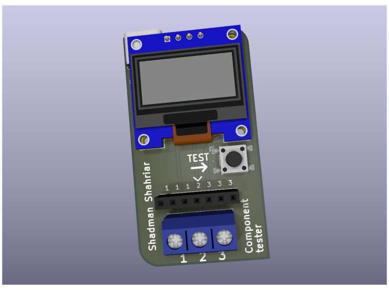

# 🔌 Component Tester  

  
*A compact and reliable device for identifying and testing electronic components.*

---

## 📖 Overview  
The **Component Tester** is a compact and affordable device for makers, hobbyists, and engineers.  
It can automatically identify and measure a wide variety of electronic components.  

✅ Detects component type automatically  
✅ Measures key parameters with accuracy  
✅ Simple interface and easy-to-use  
✅ Clear OLED Display
✅ USB Type-C for power in

---

## 🛠 Features  
- Resistor measurement (Ω)  
- Capacitor measurement (pF to mF)  
- Inductor measurement (µH to H)  
- Transistor type & pinout detection  
- Diode forward voltage  
- MOSFET parameters  

---

## 📷 Product Image  

  

---
